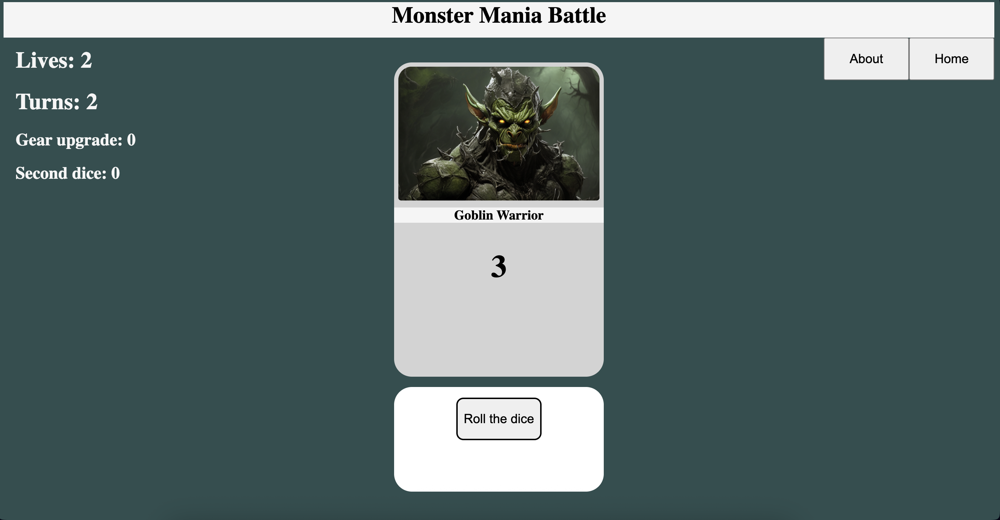
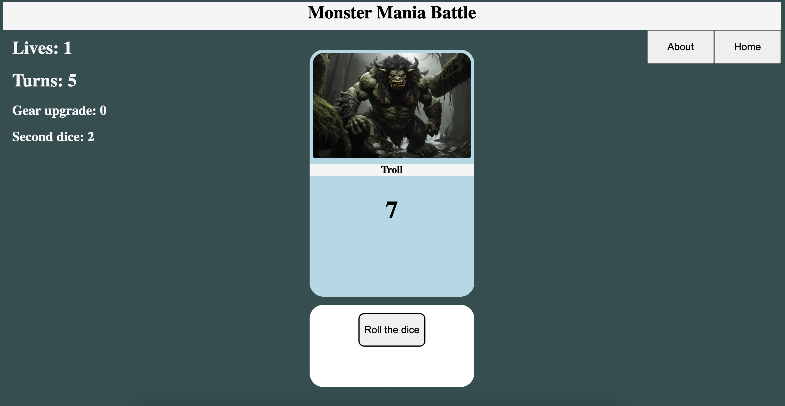
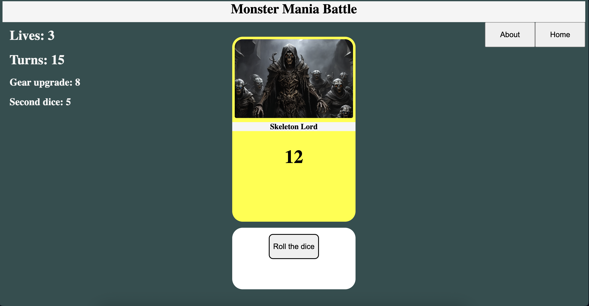

# 🎲 Dice-Based Battle Game

A simple battle game driven entirely by the roll of the dice.

All images used in the game were generated using AI.

This is my first Node.js project, created as a learning exercise and a way to practice fundamental concepts. While it may not be flawless, I hope you’ll still find it enjoyable to play.

You may find the gameplay repetitive or challenging after a few rounds, but I appreciate you taking the time to try it out.

## 🖼️ Screenshots
  

## ⚙️ Setup and Running the Game

1. Clone the repository
```bash
git clone https://github.com/your-username/Dice-based_battle_game.git
cd Dice-based_battle_game
```

2. Install dependencies
```bash
npm install
```

3. Start the app
```bash
node index.js
```